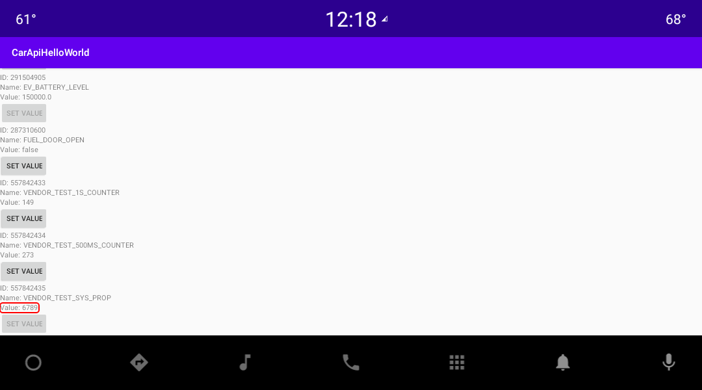

# aosp-ncar-vehicle-hal

AOSP VHAL example project 

Includes a dummy implementation of support for Google's `SYSTEM` properties [hardware/interfaces/automotive/vehicle/2.0/types.hal](https://android.googlesource.com/platform/hardware/interfaces/+/refs/tags/android-11.0.0_r48/automotive/vehicle/2.0/types.hal) and an example of extending with custom `VENDOR` properties [vendor/nkh-lab/interfaces/automotive/vehicle/1.0/types.hal](1.0/types.hal)

## Simulated VENDOR properties

Google's SYSTEM properties are not handled (only configured) but VENDOR properties are simulated. The values of some of them (e.g. VENDOR_TEST_1S_COUNTER, VENDOR_TEST_500MS_COUNTER) are simulated by timer, the value of others (e.g VENDOR_TEST_SYS_PROP) can be changed by setting the corresponding Android System Property, for example:
```
$ setprop debug.vendor.nkh-lab.VENDOR_TEST_SYS_PROP 6789 
```
and value update on CAR API client side, e.g. on [CAR API Hello World](https://github.com/nkh-lab/car-api-hello-world) app:


## Related projects

- [NCAR manifest](https://github.com/nkh-lab/aosp-ncar-manifest) - repo manifest project for getting AOSP source tree where given project is part of it 
- [NCAR device](https://github.com/nkh-lab/aosp-ncar-device)
- [CAR API Hello World](https://github.com/nkh-lab/car-api-hello-world) - Android CAR API usage example project
